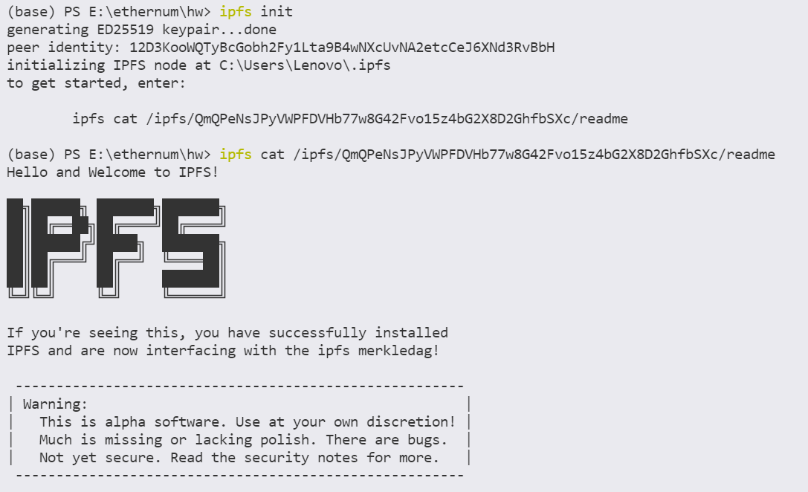

# Tyz's Big Homework

### 环境

- 操作系统：Windows 10
- IDE: VS Code
- node v14.18.1
- yarn 1.22.15
- truffle v5.4.15
- ipfs v0.10.0

### 运行方法

1. 启用ganache，新建workspace或者quickstart皆可，右上角点击图标，在workspace里面选择add project,选择项目的truffle-config.js，随后检查server里的配置要与truffle-config.js一致，再点击save and restart

2. 在进行编译solidity文件前，右键选择change workspace compiler version，换成0.5.16。然后在本地终端进行truffle compile(也可以不做这一步，因为truffle migrate也会做编译)，随后进行truffle migrate，此时ganache的contracts下面的合约对应的地址便生成了，将其复制并粘贴到src/contract.jsx中的

   ```javascript
   let address = '0x7e150E2FE8d71c0Bc65dBFDb86ddF0A9aB6c9111'
   ```

   中进行填充。然后src/contract.jsx里引用的bid.json需要手动复制经过compile后的bid.json并粘贴到contract.jsx所在的目录下（require不允许导入父目录以上的目录的文件），核心是获取到bid.json的abi。

3. 随后可以进行yarn start启用。

4. 前端加载完毕后将ganache显示的账户中导入几个私钥到metamask中,metamask要与localhost:8545连接

5. 本地终端输入ipfs daemon开启节点，用于上传图片。


### 关于ipfs的配置

ipfs第一次下载后需要执行一次

```sh
ipfs init
```

，然后出现过以下提示，只要跟着做就行了




另外，我是在windows环境下完成的作业，ipfs还需要进行一些其他的配置，参考了https://blog.csdn.net/Phather/article/details/104240781和https://github.com/ipfs/go-ipfs/issues/2034进行了一些配置


否则不能跨域，作业运行不了


### 运行成功后的界面截图

#### 初始界面


#### “我的nft”界面

##### 经过铸造nft和一些拍卖后的界面


##### 铸造nft


##### 发起拍卖


#### “拍卖市场”界面

##### 主界面


##### 竞价界面


##### 查看持有人~~（为了图省事直接把视频中的一帧拿出来当截图了）~~


#### 我参与的拍卖界面

~~（为了图省事和展示全继续把视频中的若干帧拿出来当截图）~~

##### 和当前账号相关的未结束的拍卖


##### 和当前账号相关的已经结束的拍卖


##### 预览图片


